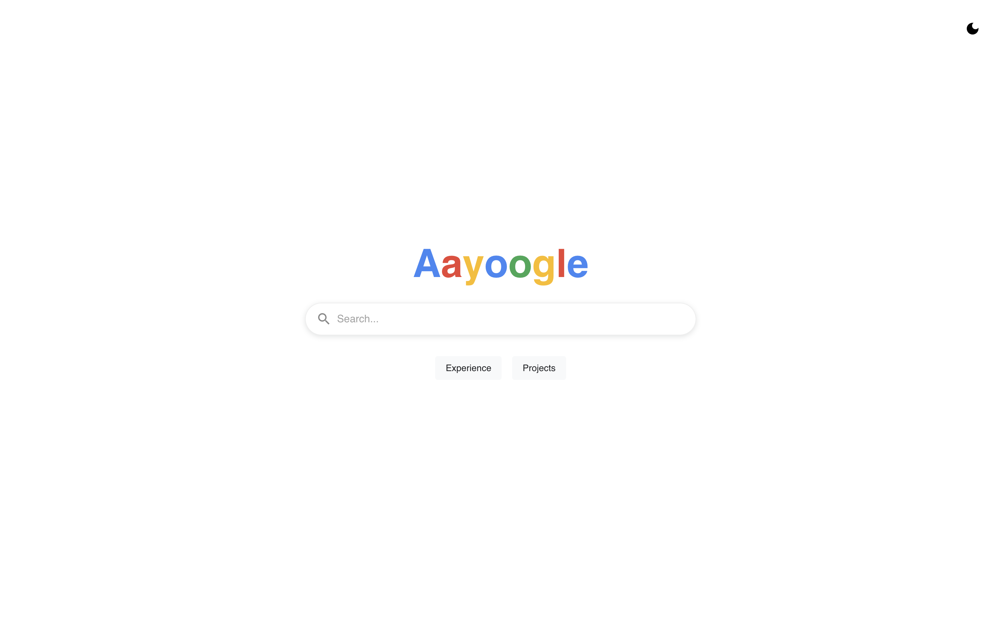
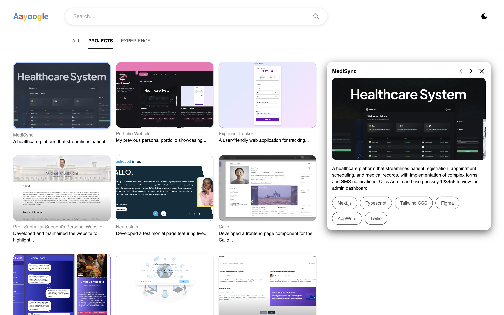
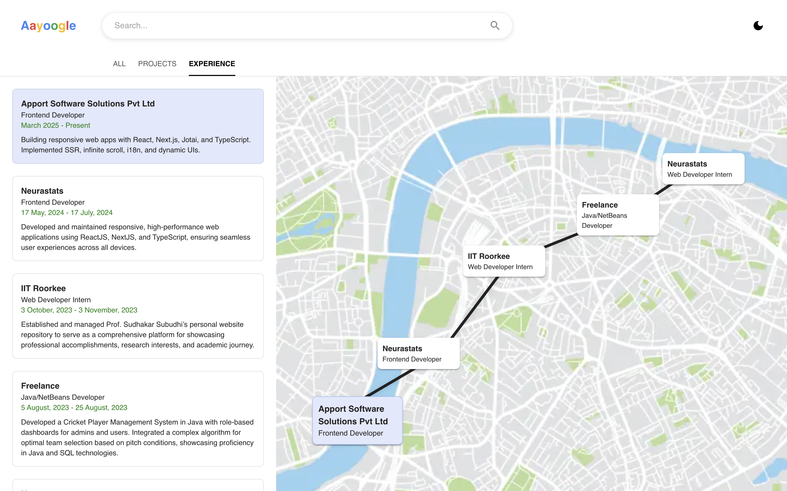

Aayushi Agarwal – Personal Portfolio

This is my personal portfolio website, designed with a **Google Search-inspired UI**. It's minimal, fast, and clean — built to highlight my projects, skills, and experience in a familiar and intuitive layout.

## ✨ Features

* 🔍 **Landing Page Inspired by Google Search**

  * Clean, centered search bar with subtle animation

* 🗂️ **Projects Explorer**

  * Project cards
  * Highlighted featured projects with smooth hover/expand UI
  * Tech stack tags and live links

* 🕒 **Experience Timeline**

  * Chronological, map-style layout using spatial coordinates
  * Context-rich entries

* 🧠 **Tech Stack Showcase**

  * Technologies I frequently use (React, TypeScript, Next.js, Tailwind, MUI, etc.)

* 🎨 **Dark Mode Ready**

  * Fully themed using Material UI and Emotion

## 🛠️ Tech Stack

* **Frontend:** React, Next.js (App Router)
* **Styling:** Emotion, Material UI (MUI)
* **State Management:** React Hooks
* **Animations:** Framer Motion
* **Build & Deploy:** Vercel

## 🚀 Getting Started

Clone the repository and run locally:

```bash
git clone https://github.com/yourusername/portfolio-google-ui.git
cd portfolio-google-ui
npm install
npm run dev
```

Visit `http://localhost:3000` to view the app.

## 📦 Deploy

This portfolio is deployed on **Vercel**. You can fork and deploy it in seconds:

[](https://vercel.com/new)

## 📸 Preview


*A minimalist, Google-style entry screen*


*Interactive project showcase*


*Map based Expereince section*

## 🧑‍💻 About Me

Hi! I’m **Aayushi Agarwal**, a front-end developer passionate about building elegant UIs, meaningful web experiences, and fun side projects. You can learn more about me and my work [on the website]([https://yourdomain.com](https://portfoliov2-pi-five.vercel.app/)).

## 📫 Contact

* LinkedIn: [linkedin.com/in/aayushi-agarwal](https://www.linkedin.com/in/aayushi-agarwal-bb104222b/)
* GitHub: [github.com/aayushi-agarwal](https://github.com//aayushi-agrwal)
* Email: [you@example.com](mailto:aayushiagrwall@gmail.com)
